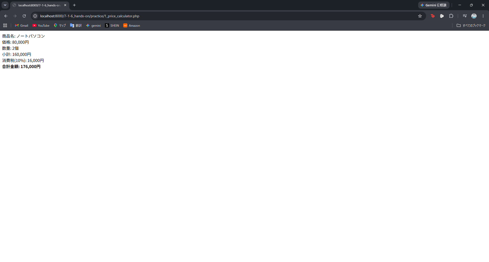

# php-basics-practice

## 概要
COACHTECH 教材 Tutorial 7-1「PHPの基礎 ハンズオン演習」で作成した成果物です。
1.商品価格を計算するプログラム(price_calculator.php)
2-1.割引計算プログラム(discount_calculator.php)
2-2.偶数奇数判定プログラム(even-odd.php)
2-3.複数条件の割引計算プログラム(discount_calculator2.php)
2-4.スコア計算プログラム(score-simulator.php)
を作成しました。

## 使用技術
- PHP 8.5.7
- Docker / Nginx

## 学んだこと
- 基本的なPHPを使ったプログラムの作成方法
- docker環境を構築するにあたってindex.phpを含めないと"http://localhost:8000" にアクセスしたときエラーが発生すること
- .gitignoreという設定ファイルによってgitに含めない方法があるということ

## 詰まったポイントと解決方法
- gitに含める範囲について悩んだが、他人がdocker環境を再現しやすいようにプロジェクト全体をgitに含め、プッシュしないsampleディレクトリは.gitignoreファイルによって範囲から外すこととした
- 2-3_discount_calculator2.phpの作成中、ランダムでtrueとfalseを選ぶ方法が思い浮かばなかったが、(bool)mt_rand(0, 1)によって0か1を選んだ後にtrueかfalseをに強制的にキャストするという手法を知り実現した

## 開発の工夫
- 教材で示されていたようにpracticeディレクトリのみをgitの範囲にするのではなく、全体をgitの範囲にし、動作確認をしやすいようにした
- 数値や結果が視覚的にわかりやすいようにところどころ太字で強調した

## 動作確認のスクショ

## 動作確認
本プロジェクトは Docker を使用して開発環境を構築しています。以下の手順で環境を起動し、動作確認を行うことができます。

### 前提条件
- パソコンに"Docker Desktop"がインストールされ、起動していること。
- Git Bash などのターミナルが利用できること。

### 起動手順
本環境はDockerで構築しています。以下の手順で起動してください。

1.dockerを起動する
"docker-compose.yml"がある階層で以下のコマンドを実行します。
docker compose up -d
　
2.ブラウザで確認する
http://localhost:8000/7-1-6_hands-on/practice/開きたいファイル

